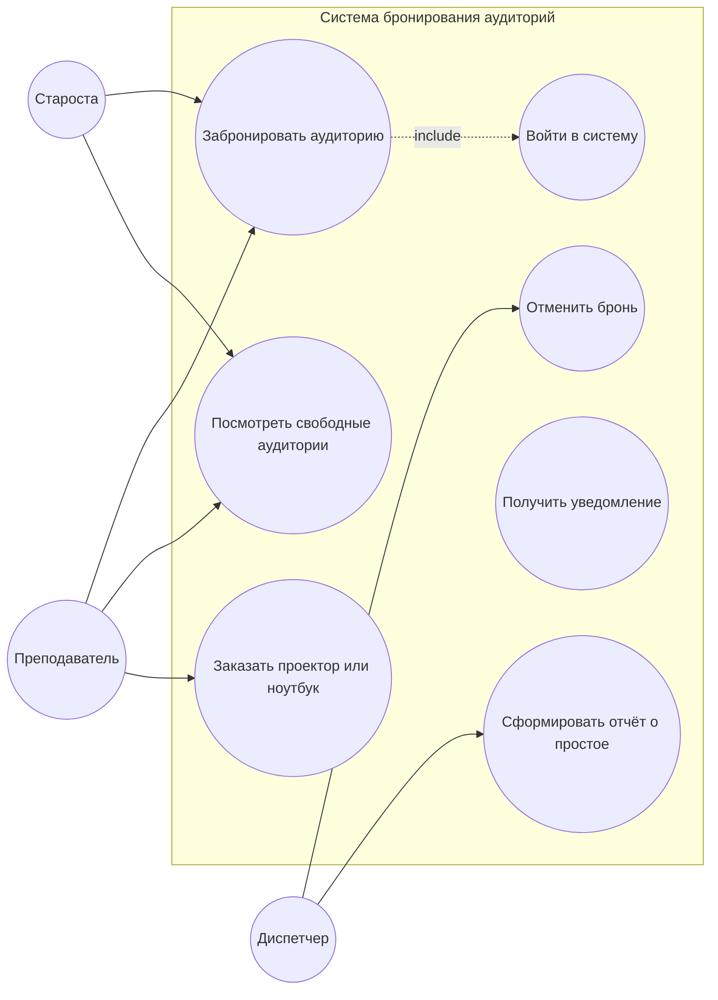

```mermaid
    flowchart LR
    Starosta((Староста))
    Prepod((Преподаватель))
    Dispatcher((Диспетчер))

    subgraph Система бронирования аудиторий
        UC1(("Забронировать аудиторию"))
        UC2(("Посмотреть свободные аудитории"))
        UC3(("Отменить бронь"))
        UC4(("Войти в систему"))
        UC5(("Получить уведомление"))
        UC6(("Сформировать отчёт о простое"))
        UC7(("Заказать проектор или ноутбук"))
    end

    Starosta --> UC1
    Starosta --> UC2
    Prepod --> UC1
    Prepod --> UC2
    Prepod --> UC7
    Dispatcher --> UC3
    Dispatcher --> UC6
    UC1 -.include.-> UC4
```